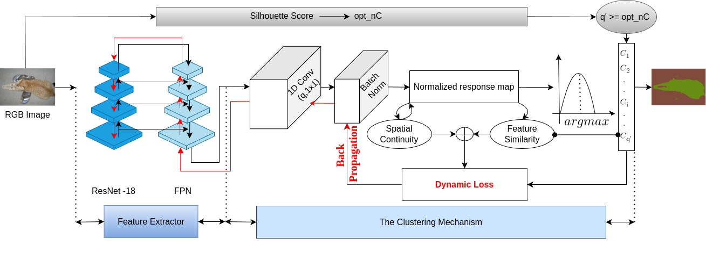

# DynaSeg: A deep dynamic fusion method for unsupervised image segmentation incorporating feature similarity and spatial continuity

**Authors:** [Boujemaa Guermazi](mailto:bguermazi@torontomu.ca), [Riadh Ksantini](mailto:rksantini@uob.edu.bh), [Naimul Khan](mailto:n77khan@torontomu.ca )


Official repository for [DynaSeg: A Deep Dynamic Fusion Method for Unsupervised Image Segmentation](https://doi.org/10.1016/j.imavis.2024.105206). This includes clean code and instructions for reproducing the results reported in our [Image and Vision Computing journal paper](https://doi.org/10.1016/j.imavis.2024.105206).

## Overview
DynaSeg is a deep dynamic fusion method for unsupervised image segmentation that effectively balances feature similarity and spatial continuity. It automates parameter tuning through dynamic weighting, allowing for efficient segmentation without extensive hyperparameter adjustments. DynaSeg integrates seamlessly with existing segmentation networks and has been tested to achieve state-of-the-art performance on multiple benchmark datasets.

## Installation
To set up DynaSeg, you need to install the following OpenMMLab packages:

- **MIM** >= 0.1.5
- **MMCV-full** >= v1.3.14
- **MMDetection**
- **MMSegmentation**
- **MMSelfSup**

Install the required packages using the following commands:

```bash
pip install openmim mmdet mmsegmentation mmselfsup
mim install mmcv-full
``` 

## Data Preparation
To prepare the necessary data for training, follow these steps:

1. **Download Datasets**:
   - **Training Set**: [Download the training set](http://images.cocodataset.org/zips/train2017.zip) of the COCO dataset.
   - **Validation Set**: [Download the validation set](http://images.cocodataset.org/zips/val2017.zip) of the COCO dataset.
   - **Stuffthing Map**: [Download the stuffthing map](http://calvin.inf.ed.ac.uk/wp-content/uploads/data/cocostuffdataset/stuffthingmaps_trainval2017.zip).

2. **Unzip and Organize Data**: Unzip the data and organize it into the following directory structure:

```kotlin
data/
├── curated
│   ├── train2017
│   │   ├── Coco164kFull_Stuff_Coarse_7.txt
│   ├── val2017
│   │   ├── Coco164kFull_Stuff_Coarse_7.txt
├── coco
│   ├── annotations
│   │   ├── train2017
│   │   │   ├── xxxxxxxxx.png
│   │   ├── val2017
│   │   │   ├── xxxxxxxxx.png
│   ├── train2017
│   │   ├── xxxxxxxxx.jpeg
│   ├── val2017
│   │   ├── xxxxxxxxx.jpeg
``` 

The curated directory contains the data splits for unsupervised segmentation, structured according to the splits used by [PiCIE](https://github.com/janghyuncho/PiCIE).

## Testing
To evaluate DynaSeg on different datasets, follow these instructions:

### COCO Dataset:
- Use the script `tools/DynaSeg_COCO.py` to run the testing on the COCO dataset.
- The mIoU (mean Intersection over Union) for all images will be stored in `eval_results.pkl`.

### Pascal VOC 2012 and BSD500 Datasets:
- Use the script `tools/DynaSeg_SCF_BSD_VOC.py` to run the testing on the Pascal VOC 2012 and BSD500 datasets.
- After running the tests, you can calculate the mIoU using the script `tools/calculate_mIOU.py`.

## Acknowledgement
This codebase is based on [MMCV](https://github.com/open-mmlab/mmcv), and it benefits a lot from [DenseSiam](https://github.com/ZwwWayne/DenseSiam), [PiCIE](https://github.com/janghyuncho/PiCIE), [MMSelfSup](https://github.com/open-mmlab/mmselfsup), and [Detectron2](https://github.com/facebookresearch/detectron2).


## License
This project is licensed under the [MIT License](LICENSE).
## Citation
If you use DynaSeg in your research, please cite our work:
```sql
@article{guermazi2024dynaseg,
  title={DynaSeg: A deep dynamic fusion method for unsupervised image segmentation incorporating feature similarity and spatial continuity},
  author={Guermazi, Boujemaa and Ksantini, Riadh and Khan, Naimul},
  journal={Image and Vision Computing},
  pages={105206},
  year={2024},
  publisher={Elsevier}
}
```
